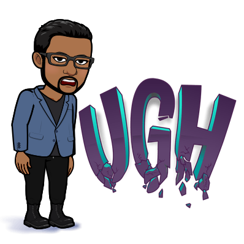

# Hello, folks! 

You can find me on [![Instagram][1.2]][1] or [![LinkedIn][2.2]][2].

<!-- Icons -->

[1.2]: https://github.com/shreyasY2k/shreyasY2k/blob/master/insta.png (insta icon without padding)
[2.2]: https://github.com/MartinHeinz/MartinHeinz/master/linkedin-3-16.png (LinkedIn icon without padding)

<!-- Links to your social media accounts -->

[1]: https://instagram.com/shreyas_mathur_kaushik/
[2]: https://www.linkedin.com/in/shreyas-m-k-b213771a4/

<!--
**shreyasY2k/shreyasY2k** is a ✨ _special_ ✨ repository because its `README.md` (this file) appears on your GitHub profile.

Here are some ideas to get you started:

- 🔭 I’m currently working on ...
- 🌱 I’m currently learning ...
- 👯 I’m looking to collaborate on ...
- 🤔 I’m looking for help with ...
- 💬 Ask me about ...
- 📫 How to reach me: ...
- 😄 Pronouns: ...
- ⚡ Fun fact: ...
-->
